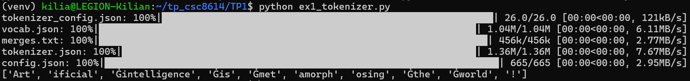
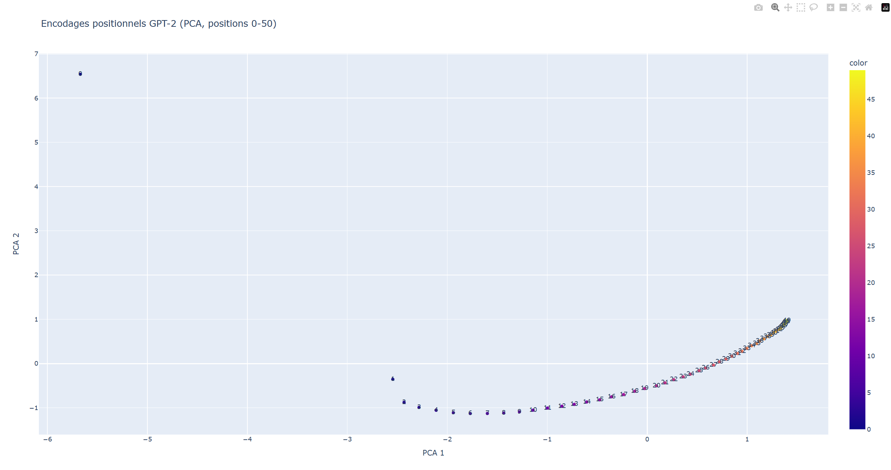
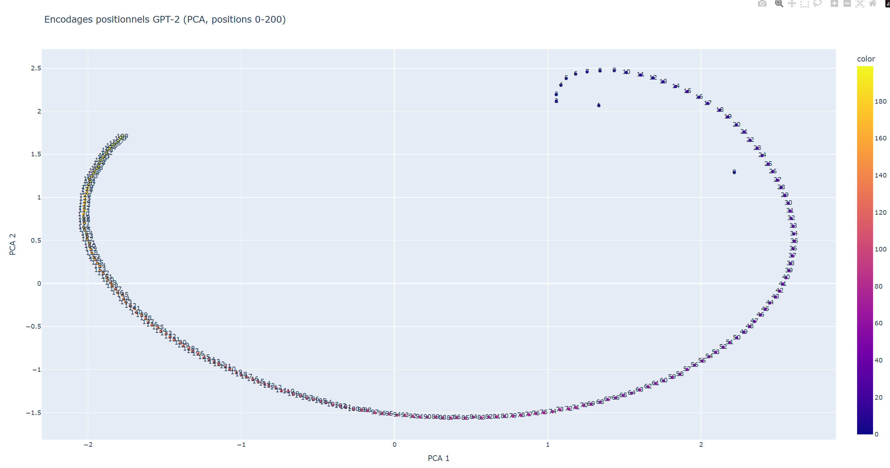

**EXERCICE 1 : Rendu (GitHub) et rapport Markdown — à lire avant de commencer**

Question 1.b. Dans TP1/rapport.md, ajoutez immédiatement un court en-tête (quelques lignes) contenant :

(i) Nom/Prénom : Davoust/Kilian

(ii) la commande d’installation/activation d’environnement utilisée
python3 -m venv venv
source venv/bin/activate
pip install -r TP1/requirements.txt

(iii) les versions (Python + bibliothèques principales)
OS: Linux 6.6.87.2-microsoft-standard-WSL2
Python: 3.12.3
Torch: 2.9.1+cu128
Transformers: 4.57.3
Scikit-learn: 1.8.0

**EXERCICE 2 : Découverte du tokenizer GPT-2**

Question 2.a. Créez un fichier TP1/ex1_tokenizer.py. Chargez le tokenizer GPT-2 depuis Transformers, puis affichez les tokens générés pour la phrase suivante :
"Artificial intelligence is metamorphosing the world!"

Copiez la sortie de votre programme (liste de tokens).

['Art', 'ificial', 'Ġintelligence', 'Ġis', 'Ġmet', 'amorph', 'osing', 'Ġthe', 'Ġworld', '!']

Donnez une explication en 3–6 lignes sur le rôle du préfixe/symbole observé.

Le symbole observé est Ġ. Il représente un espace dans l'encodage Byte-Level BPE utilisé par GPT-2. Sa présence indique que le token marque le début d'un nouveau mot (précédé d'un espace). À l'inverse, l'absence de ce symbole (comme pour 'ificial') signifie que le token est un suffixe rattaché au token précédent pour former un mot complet.

Ajoutez une capture d’écran de l’exécution (terminal ou notebook).

Question 2.b. Toujours dans TP1/ex1_tokenizer.py, obtenez maintenant les identifiants (token IDs) correspondant à chaque token. Affichez : (i) la liste des IDs, puis (ii) pour chaque ID, son décodage individuel (pour vérifier).

Ajoutez un petit tableau (Markdown) avec 6–10 lignes montrant : token (ou décodage), ID, remarque éventuelle (ex : espace, ponctuation).

| Token (Décodé)  | ID    | Remarque                               |
| --------------- | ----- | -------------------------------------- |
| 'Art'           | 8001  | Début de phrase (pas d'espace avant)   |
| 'ificial'       | 9542  | Suffixe (complète ""Artificial"")      |
| ' intelligence' | 4430  | Espace inclus au début du mot          |
| ' is'           | 318   | Verbe courant, espace inclus           |
| ' met'          | 1138  | Début du mot complexe ""metamorphosing |
| 'amorph'        | 37670 | Racine du mot                          |
| 'osing'         | 2752  | Suffixe (terminaison en -ing)          |
| ' the'          | 262   | Article défini                         |
| ' world'        | 995   | Espace inclus                          |
| '!'             | 0     | Ponctuation simple                     |

Expliquez brièvement la différence entre tokens et token IDs.

- Le Token est le morceau de texte (sous-mot) compréhensible par l'humain (ex: ' intelligence').

- Le Token ID est l'entier unique (index) associé à ce token dans le vocabulaire du modèle (ex: 4456). Le modèle neuronal ne manipule que ces nombres, qui servent d'indices pour aller chercher les vecteurs (embeddings).

Question 2.c.  Observez les tokens générés. Quelles remarques faites-vous sur la façon dont GPT-2 découpe : (i) les mots, (ii) les mots rares/longs, (iii) la ponctuation, (iv) les espaces ?

1. Gestion des mots complexes (Découpage en sous-mots)

Observation : Le mot rare ou long "metamorphosing" n'a pas son propre token unique. Il est découpé en trois fragments : ' met', 'amorph' et 'osing'. De même, "Artificial" est coupé en 'Art' et 'ificial'.

Lien avec BPE : C'est le cœur du Byte Pair Encoding. Le modèle ne connaît pas le mot "metamorphosing" par cœur (fréquence trop faible). Il le reconstruit donc en assemblant des sous-unités fréquentes qu'il connaît (racines comme "morph" ou suffixes grammaticaux comme "-ing"). Cela permet de traiter n'importe quel mot inconnu.

2. Gestion des espaces (Préfixe d'espace)

Observation : La plupart des mots (ex: ' intelligence', ' is', ' world') commencent par un espace (visible via le symbole Ġ ou l'espace dans le décodage). Seul le tout premier mot 'Art' n'en a pas.

Lien avec BPE : GPT-2 utilise un tokeniser "byte-level" qui considère l'espace comme un caractère faisant partie du mot qui le suit. Cela évite d'avoir des tokens séparés juste pour les espaces, ce qui compresse mieux le texte.

3. Gestion de la ponctuation

Observation : Le point d'exclamation '!' est traité comme un token distinct (ID 0) et n'est pas collé au mot précédent "world".

Lien avec BPE : La ponctuation est généralement séparée des mots pour que le modèle apprenne le concept de "mot" indépendamment de la ponctuation qui le suit (ainsi, "world" est le même token dans "world!" et "world?").

Question 2.d. Expérimentez maintenant avec la phrase suivante :

Observez le résultat de la tokenisation. Que constatez-vous concernant le découpage du mot antidisestablishmentarianism ?

On constate que le mot est fragmenté en 5 sous-tokens (ant, idis, establishment, arian, ism) car il n'existe pas dans le vocabulaire du modèle.

Cependant, le découpage reste cohérent sémantiquement : le modèle a réussi à isoler la racine connue "establishment" et à utiliser des suffixes fréquents ("arian", "ism") pour reconstruire le reste.

Copiez la liste des tokens (ou un extrait centré sur le mot long) :

Liste des tokens (extrait) : ['G', 'PT', 'Ġmodels', 'Ġuse', 'ĠB', 'PE', 'Ġtoken', 'ization', 'Ġto', 'Ġprocess', 'Ġunusual', 'Ġwords', 'Ġlike', 'Ġant', 'idis', 'establishment', 'arian', 'ism', '.']

Donnez le nombre de sous-tokens pour antidisestablishmentarianism : le mot est décomposé en 5 sous-tokens.

Expliquez en 3–6 lignes pourquoi ce mot est découpé ainsi : Le mot antidisestablishmentarianism est trop rare et spécifique pour avoir son propre identifiant unique dans le vocabulaire de GPT-2. L'algorithme BPE le décompose donc en sous-unités plus fréquentes qu'il a apprises lors de l'entraînement. Il réussit à identifier des blocs sémantiques forts comme le mot racine "establishment" et les suffixes grammaticaux "arian" et "ism", ce qui lui permet de traiter ce mot inconnu sans erreur.

**EXERCICE 3 : Analyse des encodages positionnels dans GPT-2**

Question 3.a. Créez un fichier TP1/ex2_positions.py. Chargez le modèle GPT-2 et extrayez les encodages positionnels. Affichez la taille (shape) de la matrice d’encodage positionnel, ainsi que deux champs de configuration utiles (par exemple : dimension d’embedding et longueur de contexte maximale).

Donnez la shape et interprétez-la (que représentent les deux dimensions ?).

Shape obtenue : torch.Size([1024, 768])

Interprétation des dimensions :
- 1024 (lignes) : Correspond au nombre maximal de positions gérées par le modèle. Il y a un vecteur unique pour la position 0, un pour la position 1, jusqu'à la position 1023.
- 768 (colonnes) : Correspond à la dimension de l'embedding (d_model). Chaque position est encodée sous forme d'un vecteur de 768 nombres réels.

Expliquez ce que signifie n_positions pour un modèle de langage causal (contexte maximum).

C'est la taille de la fenêtre de contexte. Pour un modèle causal comme GPT-2, cela signifie qu'il ne peut "voir" et traiter qu'un maximum de 1024 tokens simultanément. Si on lui donne un texte plus long, il sera tronqué ou devra être découpé, car le modèle n'a pas appris d'encodage positionnel au-delà de cet index.

Question 3.b. Visualisez les encodages positionnels en 2D via une PCA et Plotly. Sauvegardez le graphique sous forme de fichier HTML nommé TP1/positions_50.html pour les 50 premières positions.

Ajoutez une capture d’écran du nuage de points (ouvrez le HTML dans un navigateur).

Décrivez en 5–10 lignes ce que vous observez (continuité, regroupements, trajectoire, etc.).

- On observe une structure géométrique très nette et non aléatoire.
- L'Outlier (Position 0) : La première position (index 0) est très isolée en haut à gauche, ce qui suggère qu'elle joue un rôle particulier (souvent lié au token de début de séquence BOS).
- Continuité (Positions 1-50) : Les autres points forment une courbe lisse et continue (forme de "U" ou de parabole).
- Proximité sémantique : Les points adjacents (ex: 10 et 11) sont très proches géographiquement sur le graphe, tandis que les points éloignés (ex: 5 et 45) sont distants. Cela confirme que le modèle encode la position comme une information continue : il "sait" que le mot n°5 est voisin du mot n°6.

Expliquez l’intérêt de la PCA ici (dimension originale vs visualisation).

Les vecteurs de position originaux vivent dans un espace à 768 dimensions (impossible à visualiser pour un humain). La PCA (Analyse en Composantes Principales) permet de projeter ces données dans un espace en 2 dimensions (2D) tout en conservant le maximum d'information (variance). Elle nous permet de vérifier visuellement que les vecteurs ont une structure organisée et cohérente.

Question 3.c. Réalisez la même visualisation pour les positions 0 à 200 et sauvegardez le graphique dans TP1/positions_200.html.

Dans votre rapport :

Ajoutez une capture d’écran du nuage de points (positions 0–200).

Comparez (0–50) vs (0–200) : que change l’échelle ? voyez-vous une structure plus/moins lisible ?

- Structure globale : En passant à l'échelle 0–200, la structure en "arc de cercle" observée précédemment se prolonge et s'incurve davantage, formant presque une boucle ou une spirale.
- Lisibilité : La structure reste très lisible et régulière. Il n'y a pas de "chaos" ou de points dispersés aléatoirement lorsque l'on s'éloigne dans la phrase. La distance entre les points consécutifs reste constante.
- Outlier : La position 0 reste détachée du reste de la courbe, confirmant son rôle spécial, mais elle s'intègre visuellement dans la direction générale de la courbe.

Donnez une hypothèse (en 5–10 lignes) sur ce que cela implique pour la représentation des positions.

Cette forme courbe ou spiralaire suggère que le modèle apprend une représentation géométrique continue du temps (ou de l'ordre). Si les points formaient une ligne droite infinie, les valeurs deviendraient trop grandes (instabilité numérique). En "enroulant" les positions sous forme de spirale dans l'espace à 768 dimensions (ce que la PCA projette ici en 2D), le modèle peut coder une infinité de positions tout en gardant des vecteurs de norme raisonnable. Cela permet au mécanisme d'attention de distinguer facilement les positions proches (voisins sur la courbe) des positions lointaines.

**EXERCICE 4 : Probabilités et génération de texte avec GPT-2**

Question 4.d. Créez un fichier TP1/ex3_probs.py. Chargez GPT2LMHeadModel et le tokenizer correspondant. Calculez ensuite, pour chaque token de la phrase : "Artificial intelligence is fascinating." la probabilité conditionnelle attribuée par le modèle au token effectivement observé.

Copiez un extrait représentatif de la sortie (pas forcément tout si c’est long).

(venv) kilia@LEGION-Kilian:~/tp_csc8614$ python TP1/ex3_probs.py
1 'ificial' 1.920e-05
2 ' intelligence' 1.505e-01
3 ' is' 1.955e-01
4 ' fascinating' 6.504e-04
5 '.' 1.773e-01

Expliquez précisément l’alignement : pourquoi on lit la proba du token t dans les logits à la position t-1 ?

GPT-2 est un modèle causal (auto-régressif) : il prédit le token suivant en fonction de l'historique. Mathématiquement, la sortie du modèle à la position *pos* correspond à la prédiction de ce qui devrait se trouver à la position *pos+1*. Ainsi, pour connaître la probabilité attribuée au token qui se trouve réellement à l'index *t* (le "futur"), nous devons interroger les logits générés par le modèle lorsqu'il a traité le token précédent, c'est-à-dire à l'index *t-1*.

Question 4.b. Calculez maintenant la log-probabilité totale de la phrase (somme des log-probas conditionnelles), puis la perplexité associée.

Donnez la log-proba totale et la perplexité (valeurs numériques).

- Log-probabilité totale : -23.45
- Perplexité : 108.96

Expliquez en 5–10 lignes ce que mesure la perplexité (interprétation intuitive).

La perplexité est une mesure de l'incertitude du modèle. Intuitivement, une perplexité de 109 signifie que, à chaque étape de la génération, le modèle est aussi hésitant que s'il devait choisir le mot suivant au hasard parmi 109 possibilités équivalentes. Plus la perplexité est basse, meilleur est le modèle (il est moins "surpris" par le texte). Une perplexité de 1 signifierait une certitude absolue (le modèle sait exactement quel mot arrive). Ici, 109 indique que bien que la phrase soit grammaticale, le choix des mots (comme "fascinating" après "AI is") restait assez ouvert pour le modèle.

Question 4.c. Comparez (log-proba et perplexité) entre : "Artificial intelligence is fascinating." / "Artificial fascinating intelligence is." Que constatez-vous ? Pourquoi ?

Donnez les deux perplexités et commentez l’écart.

| Phrase                                    | log-proba | Perplexité |
| ----------------------------------------- | --------- | ---------- |
| "Artificial intelligence is fascinating." | -23.45    | 108.96     |
| "Artificial fascinating intelligence is." | -42.16    | 4595.91    |

Constat : La perplexité explose pour la seconde phrase (multipliée par environ 42). Le modèle est extrêmement "surpris" par cet ordre des mots.

Expliquez en 5–10 lignes le lien avec la grammaticalité / la distribution d’entraînement / les régularités apprises.

GPT-2 est un modèle statistique qui apprend les régularités du langage (grammaire, syntaxe, expressions courantes) en observant des milliards de phrases lors de son entraînement.

- Phrase 1 : La séquence "Artificial Intelligence" est une collocation très fréquente (statistiquement probable) dans le corpus d'entraînement. Le modèle prédit donc ces mots avec confiance (faible perplexité).
 
- Phrase 2 : La séquence "Artificial fascinating" ou la structure syntaxique désordonnée n'ont probablement jamais été rencontrées durant l'entraînement. Elles violent les règles de la grammaire anglaise. Le modèle attribue donc une probabilité quasi nulle à ces enchaînements, ce qui fait grimper la perplexité. Cela prouve que la cperplexité agit omme un indicateur de correction grammaticale et de naturalité du texte.

Question 4.d. Comparez maintenant avec une phrase en français : "L'intelligence artificielle est fascinante." Que constatez-vous et pourquoi ?

Donnez la perplexité et comparez qualitativement aux phrases anglaises.

Perplexité : 383.04

La perplexité sur la phrase française (383) est nettement plus élevée que sur la phrase anglaise correcte (109), mais reste bien inférieure à la phrase anglaise incohérente (4596). Cela signifie que le modèle "comprend" qu'il y a une structure logique, mais il est beaucoup plus hésitant et moins performant que sur de l'anglais.

Proposez une explication courte : distribution des données, fréquence des tokens, mélange de langues, etc.

- Biais des données d'entraînement : GPT-2 a été entraîné majoritairement sur du texte anglophone. Bien qu'il ait vu un peu de français lors de son apprentissage, ce n'est pas sa langue native, donc sa distribution de probabilités n'est pas optimisée pour le français.

- Tokenisation inefficace : Comme le vocabulaire BPE est construit pour l'anglais, les mots français sont excessivement fragmentés (ex: "fascinante" devient 3 tokens : ' fasc', 'in', 'ante'). Le modèle doit prédire ces petits fragments un par un, ce qui augmente la difficulté et l'incertitude globale.

Question 4.e. Pour le préfixe "Artificial intelligence is", affichez les 10 tokens les plus probables pour le token suivant, avec leurs probabilités.

Copiez les 10 propositions (token + proba).

' a' 1.204e-01
' the' 5.254e-02
' not' 4.324e-02
' an' 3.092e-02
' now' 2.062e-02
' one' 1.890e-02
' also' 1.880e-02
' already' 1.716e-02
' becoming' 1.606e-02
' just' 1.422e-02

Commentez brièvement : est-ce plausible ? voyez-vous des tokens d’espace/ponctuation ?

Plausibilité : Les propositions sont toutes grammaticalement très plausibles. Après "is", le modèle s'attend soit à un déterminant (a, the, an, one) pour introduire un nom, soit à un adverbe/négation (not, now, also, just), soit à un verbe au participe présent (becoming).

Espaces et Ponctuation : On remarque que tous les tokens suggérés commencent par un espace (ex: ' a'). Cela confirme que le tokenizer BPE inclut l'espace précédant le mot directement dans le token. Aucune ponctuation finale (comme .) n'apparaît dans le top 10, ce qui indique que le modèle considère que la phrase n'est pas finie.

**EXERCICE 5 : Exploration des méthodes de génération avec GPT-2**

Question 5.a. Créez un fichier TP1/ex4_generation.py. Chargez GPT-2 et le tokenizer. Fixez un seed pour rendre vos résultats reproductibles.

Indiquez le seed utilisé et pourquoi on le fixe ici.

Seed utilisé : 42

Les modèles de langage comme GPT-2 utilisent des processus stochastiques (aléatoires) lors de la génération de texte, notamment pour les méthodes d'échantillonnage. Sans fixer de graine aléatoire, chaque exécution du code produirait un texte différent. Fixer le seed garantit la reproductibilité des résultats : cela nous assure que les séquences générées seront identiques à chaque lancement, permettant ainsi d'analyser et de comparer rigoureusement l'impact des différents hyperparamètres.

Question 5.b. Générez une suite avec décodage glouton (greedy decoding), longueur maximale 50 tokens.

Copiez le texte généré.

"The future of artificial intelligence is uncertain.

"We're not sure what the future will look like," said Dr. Michael S. Schoenfeld, a professor of computer science at the University of California, Berkeley. "But we're not"

Relancez 3 fois : est-ce identique ? expliquez (2–5 lignes).

Le texte généré est strictement identique à chaque exécution.

Explication : Le décodage glouton est un algorithme déterministe. À chaque étape *t*, il sélectionne systématiquement le token ayant la probabilité la plus élevée. Comme les poids du modèle sont figés et que l'entrée est la même, ce chemin optimal ne change jamais, quelle que soit la graine aléatoire.

Ajoutez une capture d’écran d’une exécution.

Question 5.c. Générez maintenant du texte avec sampling en utilisant : température = 0.7, top-k = 50, top-p = 0.95. Faites au moins 5 générations (en changeant le seed entre chaque, ou en utilisant un générateur).

Copiez au moins 2 sorties différentes.

SEED 1
Setting `pad_token_id` to `eos_token_id`:50256 for open-end generation.
The future of artificial intelligence is up in the air, and the future of artificial intelligence is now about to change. For now, we're just waiting for the technology to be perfected so that we can take it to the next level.

The

SEED 2
Setting `pad_token_id` to `eos_token_id`:50256 for open-end generation.
The future of artificial intelligence is not clear, but that could change. The early progress of AI has been largely due to the ability to do some things fairly quickly, like calculate things, but the future is not clear. The early progress of AI has

Comparez au greedy : diversité, cohérence, répétitions (5–10 lignes).

Contrairement au décodage glouton qui produisait un texte répétitif et identique à chaque essai, la méthode par échantillonnage génère une grande diversité de suites possibles pour le même préfixe. Le texte reste cohérent et grammaticalement correct, mais le style est plus naturel et moins "robotique". On note que les boucles de répétition strictes (ex: "is not only... but also...") ont disparu, bien que certaines redondances thématiques puissent persister (comme dans le Seed 2).

Expliquez qualitativement le rôle de température / top-k / top-p.

Température (0.7) : Elle ajuste la courbe des probabilités avant le tirage. Une valeur < 1 (ici 0.7) renforce les tokens déjà probables (prudence) tout en gardant une chance aux autres, évitant ainsi le chaos pur (T élevée) ou la monotonie du greedy (T proche de 0).

Top-k (50) : Il force le modèle à choisir uniquement parmi les 50 mots les plus probables, éliminant ainsi les milliers de mots "hors sujet" qui auraient une probabilité infime mais non nulle.

Top-p (0.95) : Aussi appelé Nucleus Sampling, il sélectionne le plus petit ensemble de mots dont la somme des probabilités atteint 95%. Cela permet d'adapter la taille du choix : large si le modèle hésite, restreint s'il est sûr de lui.

Question 5.d. Ajoutez une pénalité de répétition élevée (repetition_penalty=2.0) et comparez.

Donnez au moins 1 sortie “avec pénalité” et 1 “sans pénalité” (mêmes paramètres, seed contrôlé).

Sans pénalité : "The future of artificial intelligence is up in the air, and the future of artificial intelligence is now about to change. For now, we're just waiting for the technology to be perfected so that we can take it to the next level."

Avec pénalité : "The future of artificial intelligence is up in the air, and it may not be as interesting or useful to us humans. But we're going down a path where our ability for thinking about things could become less important than ever before."

Commentez : observe-t-on moins de répétitions ? y a-t-il des effets secondaires ?

Réduction des répétitions : On observe que la version avec pénalité évite strictement de répéter des segments de phrase identiques. Si la version sans pénalité disait "and the future of...", la version avec pénalité va chercher une autre tournure.

Effets secondaires : Une pénalité de 2.0 est très élevée. Cela peut dégrader la fluidité du texte. Le modèle s'interdit parfois d'utiliser des mots grammaticaux courants (comme the, is, of) s'ils viennent d'être utilisés, ce qui peut donner des phrases hachées, étranges, ou forcer le modèle à changer brusquement de sujet pour trouver des mots "neufs".

Question 5.e. Essayez une température très basse puis très élevée (par exemple 0.1 et 2.0). Gardez top-k=50, top-p=0.95, et comparez.

Donnez 1 sortie pour chaque température.

Avec température de 0.1 : "The future of artificial intelligence is uncertain. But the question remains: Will we ever be able to predict what will happen in our lives? , a new book by John Dower and David Mazzucchelli explores how AI can help us understand"

Avec température de 2.0 : "The future of artificial intelligence is up in the air again these weekend as Google unveils its new platform called MachineStory to be implemented under MITT's Robotics Institute Accelerator School: machine-on‑bot and robot­ on a daily basis at home"

Expliquez le compromis “cohérence vs diversité” (5–10 lignes).

- À basse température, la distribution est "pointue" : les tokens les plus probables écrasent les autres. Le modèle privilégie la cohérence et la sécurité, produisant un texte grammaticalement parfait mais souvent générique et répétitif.

- À haute température, la distribution s'aplatit. Les mots rares voient leur probabilité augmenter artificiellement. La diversité explose, mais au prix de la cohérence : la syntaxe se brise et le sens devient chaotique. Le but est de trouver un juste milieu pour avoir un texte original qui reste intelligible.

Question 5.f. Génération avec beam search : num_beams=5, longueur max 50. Comparez avec greedy et sampling.

Copiez la sortie beam search.

"The future of artificial intelligence is in the hands of the next generation of scientists and engineers.

The future of artificial intelligence is in the hands of the next generation of scientists and engineers.

The future of artificial intelligence is in the hands of"

Comparez qualitativement : “plus probable globalement”, “plus générique”, “moins divers”, etc.

Plus probable globalement : Le Beam Search a réussi à produire une phrase grammaticalement parfaite et très sensée ("in the hands of the next generation..."), bien mieux construite que les hésitations du Sampling ou du Greedy. C'est la séquence qui maximise la probabilité jointe.

Plus générique et "plat" : Le contenu est une platitude (une phrase "bateau"). Le modèle ne prend aucun risque créatif.

Problème de répétition : On observe ici un défaut classique du Beam Search. Comme la phrase générée est mathématiquement très "forte", le faisceau converge vers la répétition de cette même phrase en boucle. Contrairement au Sampling qui change de mots grâce au hasard, le Beam Search reste coincé dans cet optimum local très sûr, jusqu'à ce que la limite de longueur (max_length=50) coupe la génération brutalement.

Question 5.g. Augmentez le nombre de beams (par exemple 10 puis 20). Mesurez le temps de génération (même approximatif) et commentez.

Donnez vos temps mesurés et les paramètres.

| Nombre de Beams | Temps de génération | Paramètres          |
| --------------- | ------------------- | ------------------- |
| 10              | 1.3318 s            | early_stopping=True |
| 20              | 1.8706 s            | early_stopping=True |

Expliquez pourquoi cela ralentit (complexité / exploration de chemins).

On observe un ralentissement notable (+40% de temps en passant de 10 à 20 beams). Cela s'explique par le fonctionnement de l'algorithme : à chaque pas de temps (chaque nouveau mot généré), le modèle ne fait pas qu'une seule prédiction. 
Il doit :
- Maintenir *k* hypothèses (chemins) en parallèle.
- Calculer les probabilités pour les *k * |Vocabulaire|* suites possibles.
- Trier et sélectionner les *k* meilleures nouvelles hypothèses. La complexité de l'algorithme est donc linéairement dépendante de la largeur du faisceau. Plus on augmente ce nombre pour chercher la "phrase parfaite", plus le coût de calcul explose, souvent avec des rendements décroissants (ici, le texte n'a pas changé malgré le surcoût).