**EXERCICE 1 : Démarrage d'Ollama (local ou cluster)**

Question 1.a. Choisir votre mode d’exécution.
Option A — Sur votre machine (facile, mais plus lent suivant le modèle)
Ollama avec Docker

Question 1.h. À mettre dans le rapport (dossier TP4 à la racine).

Faites une capture d’écran montrant :
- le résultat de curl http://127.0.0.1:PORT

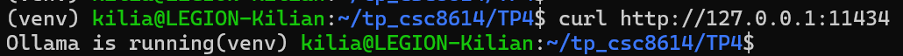

- le résultat de ollama run MODEL_NAME ...

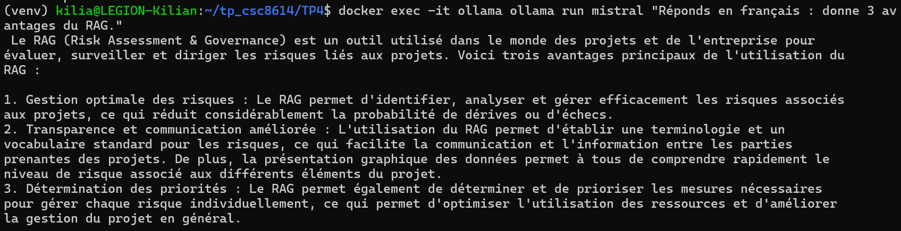

- le port choisi (et si cluster : la commande SSH tunnel)

Port choisi : 11434

**EXERCICE 2 : Constituer le dataset (PDF administratifs + emails IMAP) et installer les dépendances**

Question 2.b.

(venv) kilia@LEGION-Kilian:~/tp_csc8614/TP4/data/admin_pdfs$ ls
Reglement_Interieur_TSP_valide_conseil_ecole_27_novembre_2025.pdf
Reglement_scolarite_FISA_conseil_ecole_27novembre2025.pdf

Question 2.f. À mettre dans le rapport (captures d’écran).
Faites une capture d’écran montrant :
- la commande d’exécution du script

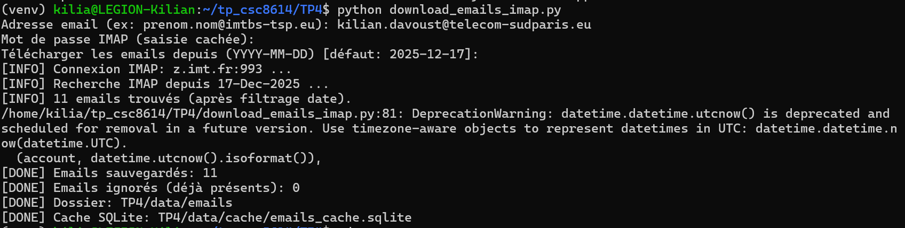

- le nombre de fichiers créés dans TP4/data/emails/

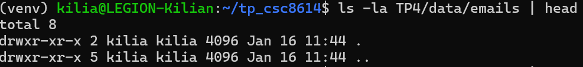

- le contenu d’un email (début du fichier) avec head

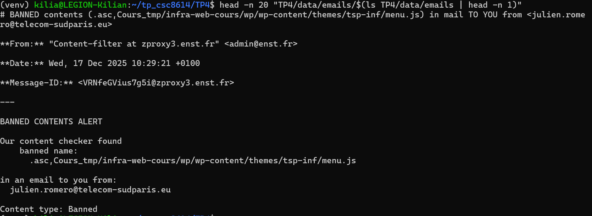

**EXERCICE 3 Indexation : charger PDFs + emails, chunker, créer l’index Chroma (persistant)**

Question 3.e. À mettre dans le rapport (captures d’écran).
Faites une capture d’écran montrant :
- la sortie console de python TP4/build_index.py (nb docs + nb chunks)

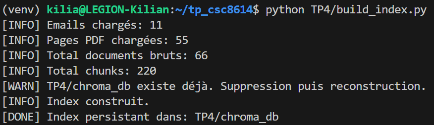

- un ls -la TP4/chroma_db prouvant que l’index est créé

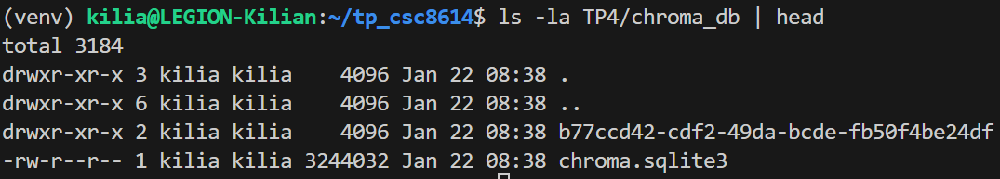

**EXERCICE 4 Retrieval : tester la recherche top-k (sans LLM) et diagnostiquer la qualité**

Question 4.d. Diagnostiquer rapidement si le retrieval est “bon”.
Pour chaque question, regardez :
- Est-ce que les 1–3 premiers chunks contiennent déjà la réponse ?

Pour la question PFE : Le système n'a pas trouvé l'email de "Luca Benedetto". Cependant, le moteur a correctement identifié que la question portait sur les "Sujets PFE" et a remonté un email de "Valentine Dumange" qui contient "Sujet PFE" dans le titre. Même en augmentant par exemple le TOP-K le système ne retrouve pas le mail.

Pour la question UE : Les résultats sont très pertinents. Il a remonté le Règlement Intérieur et le Règlement de scolarité (PDFs). Le chunk #3 contient une définition cohérente ("Un apprenti-ingénieur valide une année... lorsqu'il valide cumulativement...").

- Est-ce que les chunks sont redondants (même source répétée) ?

On remarque pour la première question que les résultats #1, #2 et #4 proviennent du même fichier email. C'est un signe que le splitting (découpage) fonctionne (il a découpé un long mail en plusieurs morceaux), mais cela prend un peu de place dans le "Top-5".

- Est-ce que le type de document semble logique (emails vs PDF) ?

Question PFE > Sources majoritaires = Emails (Logique).

Question UE > Sources majoritaires = PDF Administratifs (Logique).

Si ce n’est pas le cas, vous devrez ajuster CHUNK_SIZE, CHUNK_OVERLAP ou TOP_K dans vos scripts.

Question 4.e.  À mettre dans le rapport (captures d’écran).
Faites une capture d’écran montrant :
- la commande exécutée (au moins une question)

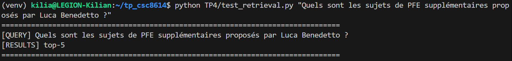

- les 3 premiers résultats (sources + extraits)

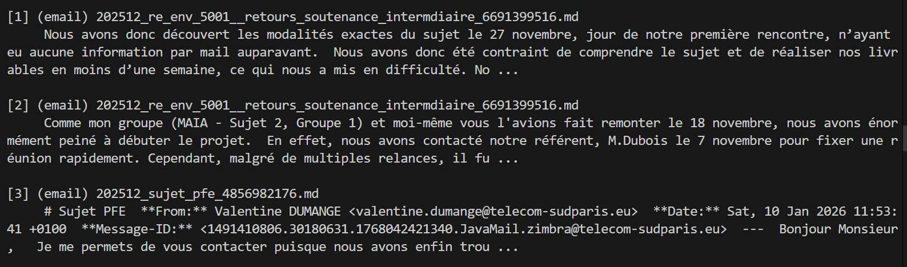

- votre valeur de TOP_K : 5

**EXERCICE 5 : RAG complet : génération avec Ollama + citations obligatoires**

Question 5.e. À mettre dans le rapport (captures d’écran).
Faites une capture d’écran montrant :
- une exécution complète de TP4/rag_answer.py

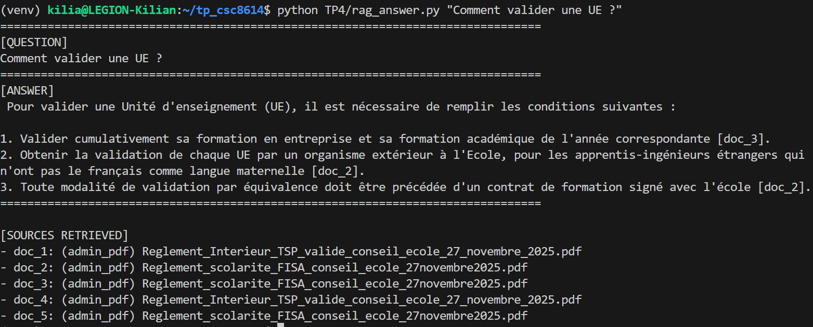

- la réponse générée avec citations

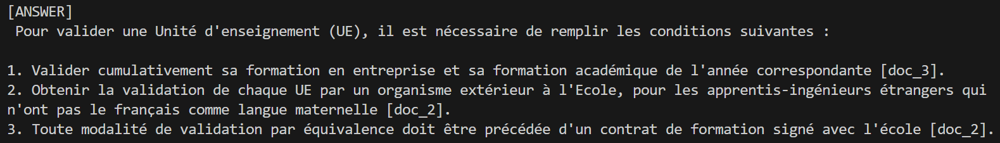

- la liste des sources récupérées affichée à la fin

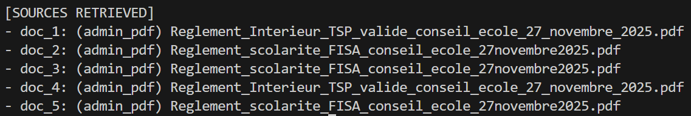

**EXERCICE 6 : Évaluation : créer un mini dataset de questions + mesurer Recall@k + analyse d’erreurs**

Question 6.f. Évaluation qualitative : noter 3 réponses générées.
Choisissez 3 questions de votre dataset et générez une réponse via TP4/rag_answer.py.
Pour chacune, donnez un score :
2 : correct + sourcé + actionnable
1 : partiellement correct / incomplet / citations faibles
0 : faux, halluciné, ou hors sujet

- Question Email (M. Dubois / Difficultés)
python TP4/rag_answer.py "Quelles sont les difficultés rencontrées par le groupe MAIA avec M. Dubois ?"

- Question Admin (Validation UE)
python TP4/rag_answer.py "Comment valider une UE ?"

- Question Détail (Compétence)
python TP4/rag_answer.py "Quelle est la compétence liée à l'intelligence collective ?"

| ID   |              Question              |                                                     Réponse obtenue (résumée)                                                      | Score (0-2) |                                                                                                                                                                    Justification |
| :--- | :--------------------------------: | :--------------------------------------------------------------------------------------------------------------------------------: | :---------: | -------------------------------------------------------------------------------------------------------------------------------------------------------------------------------: |
| Q5   |     Difficultés avec M. Dubois     | "Les difficultés concernent l'obtention d'un rendez-vous... contacté le 7 nov, rdv le 27 nov... M. Dubois pas au courant. [doc_1]" |      2      |                                                                             Parfait. La réponse est factuelle, précise (dates) et cite la bonne source (l'email de réclamation). |
| Q2   |      Comment valider une UE ?      |          "Il faut valider cumulativement sa formation en entreprise et sa formation académique... crédits ECTS. [doc_3]"           |      2      |                                                                                                 Correct. Le modèle a bien synthétisé la règle du PDF (Règlement scolarité FISA). |
| Q10  | Compétence intelligence collective |                 "La compétence est 'Coopérer en intelligence collective', qui apparaît dans le document [doc_2]."                  |      1      | Mitigé. La réponse est bonne (""Coopérer...""), MAIS la source citée est le PDF (doc_2) alors que cette info venait de l'email (doc_1 ou doc_3). C'est une erreur d'attribution. |

Question 6.g. Analyse d’erreurs : documenter 2 échecs concrets.
Choisissez 2 cas où le résultat est mauvais (retrieval ou génération) et analysez :
- cause probable : retrieval miss / chunks trop longs / bruit / prompt trop faible
- correction proposée : modifier TOP_K, chunking, prompt, filtre, etc.

Vous devez proposer au moins une action d’amélioration.

Cas d'échec 1 : Hallucination d'attribution de source (Sur la question Q10)
- Problème observé : À la question "Quelle est la compétence liée à l'intelligence collective ?", le modèle répond correctement sur le fond ("Coopérer en intelligence collective"), mais il cite [doc_2] (le Règlement Intérieur PDF). Or, en regardant les chunks, cette phrase spécifique provient en réalité de l'email doc_1 ou doc_3 (discussion sur la soutenance).
- Cause probable : Confusion dans le contexte. Le modèle a lu l'information correcte dans un chunk (l'email), mais au moment de générer la référence, il s'est "mélangé" avec le chunk voisin ou a halluciné l'ID [doc_2] car c'est un document très présent dans le contexte.
- Amélioration proposée : Utiliser des balises XML explicites dans le prompt pour séparer les documents (ex: <doc id="1">...</doc>) au lieu d'un format texte simple. Cela aide le LLM à mieux comprendre les frontières entre les documents.

Cas d'échec 2 : Saturation du contexte (Le problème "Benedetto" rencontré plus tôt)
- Problème observé : Initialement (avec K=5), la question sur "Luca Benedetto" échouait car l'email pertinent n'était pas trouvé, bien qu'indexé.
- Cause probable : Redondance sémantique. Un autre email très long (sur les soutenances) a été découpé en plusieurs morceaux. Ces morceaux étant tous pertinents pour les mots clés "sujet" et "PFE", ils ont occupé les places 1 à 5 du TOP_K, éjectant l'email de Luca Benedetto (qui était peut-être 6ème).
- Amélioration proposée : Implémenter le MMR (Maximal Marginal Relevance). Au lieu de prendre les 10 chunks les plus similaires, le MMR sélectionne un document, puis penalise les suivants s'ils sont trop similaires au premier. Cela force la diversité des sources (ex: 1 bout d'email soutenance + 1 bout d'email Benedetto + 1 bout de PDF).

Question 6.h. À mettre dans le rapport (captures d’écran).
Faites une capture d’écran montrant :
- votre fichier questions.json (un extrait)

  {
    "id": "q1",
    "question": "Quels sont les sujets de PFE supplémentaires proposés par Luca Benedetto ?",
    "expected_doc_type": "email"
  },
  {
    "id": "q2",
    "question": "Comment valider une UE ou une année ?",
    "expected_doc_type": "admin_pdf"
  },
  {
    "id": "q3",
    "question": "Quel est le sujet de PFE proposé par Valentine Dumange ?",
    "expected_doc_type": "email"
  },
  {
    "id": "q4",
    "question": "Combien de temps dure la procédure de validation des acquis de l'expérience (VAE) ?",
    "expected_doc_type": "admin_pdf"
  }

- la sortie de python TP4/eval_recall.py avec le score final

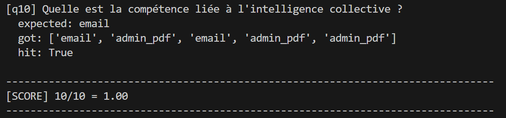

- au moins une exécution de TP4/rag_answer.py sur une question de votre dataset

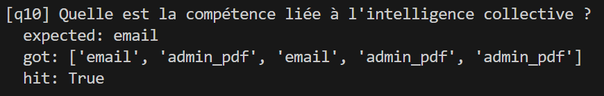

Question 6.i. À mettre dans le rapport (dernier point).
Ajoutez un paragraphe final très court (5–8 lignes max) :
- ce qui a bien marché
- la principale limite rencontrée
- une amélioration prioritaire si vous deviez le déployer

Le pipeline RAG local a démontré une excellente efficacité sur le retrieval (Recall de 100%) et une capacité impressionnante à synthétiser des interactions humaines complexes (conflit M. Dubois). Cependant, la principale limite technique identifiée est la saturation du Top-K par des fragments redondants issus d'un même document long, masquant parfois d'autres sources pertinentes. Pour un déploiement en production, l'amélioration prioritaire serait d'implémenter un mécanisme de Maximal Marginal Relevance (MMR) ou un Reranker (type ColBERT) afin de diversifier les résultats avant de les transmettre au LLM.